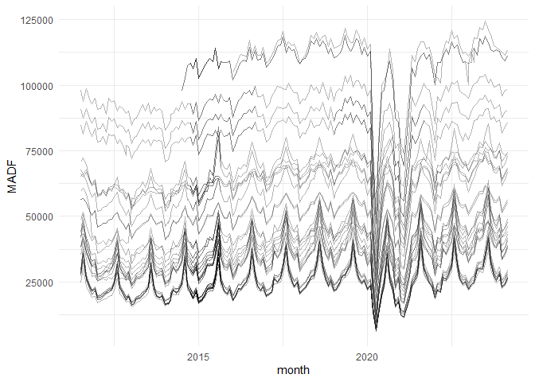

# Data from *Relatórios da Rede Rodoviária*


This repository contains code to extract the data released by the
official website of the Portuguese Instituto da Mobilidade e dos
Transportes (Institute of Mobility and Transport). The quarterly reports
contain the Montlhy Average Daily Traffic for several corridor of the
highway network of Portugal (see
[this](https://www.imt-ip.pt/sites/IMTT/Portugues/InfraestruturasRodoviarias/RedeRodoviaria/Paginas/Relatorios.aspx)).

## Loading the data

Identifying the links to the Excel files using `rvest`.

``` r
library(rvest)
library(tidyverse)
```

    ── Attaching core tidyverse packages ──────────────────────── tidyverse 2.0.0 ──
    ✔ dplyr     1.1.4     ✔ readr     2.1.5
    ✔ forcats   1.0.0     ✔ stringr   1.5.1
    ✔ ggplot2   3.5.1     ✔ tibble    3.2.1
    ✔ lubridate 1.9.3     ✔ tidyr     1.3.1
    ✔ purrr     1.0.2     
    ── Conflicts ────────────────────────────────────────── tidyverse_conflicts() ──
    ✖ dplyr::filter()         masks stats::filter()
    ✖ readr::guess_encoding() masks rvest::guess_encoding()
    ✖ dplyr::lag()            masks stats::lag()
    ℹ Use the conflicted package (<http://conflicted.r-lib.org/>) to force all conflicts to become errors

``` r
url <-  "https://www.imt-ip.pt/sites/IMTT/Portugues/InfraestruturasRodoviarias/RedeRodoviaria/Paginas/Relatorios.aspx"
```

``` r
w <- session(url)

all_links <- read_html(w) |> html_elements("a") |> html_attr("href")

xls_links <- all_links[str_detect(all_links,"^https://.*\\.xls$")&!is.na(all_links)]
```

Creating a folder to save the Excel `xls` files

``` r
dir.create("00_raw_data",showWarnings = F)
```

Downloading the files

``` r
lapply(xls_links,function(tfile){
  u <- basename(URLdecode(tfile))
  if(!file.exists(file.path("00_raw_data",u))){
    download.file(url = URLencode(URLdecode(tfile)),
                  destfile = file.path("00_raw_data",u),
                  mode = "wb" # This is for Windows to avoid corrupted files
                  )
  }

})
rm(list = ls())
```

Reading all files

``` r
local_files <- list.files("00_raw_data/",pattern = "\\.xls",full.names = T)

library(readxl)

rawdata <- lapply(local_files,read_xls)
```

Processing all the tables

``` r
all_data <- do.call(bind_rows,
        lapply(rawdata,function(mydata){
          names0 <- names(mydata)
          names1 <- (mydata |> as.matrix())[1, ]
          
          names0a <- gsub("\\.{3}\\d{1,2}", "", names0)
          names0b <- zoo::na.locf(replace(names0a, names0a == "", NA), na.rm = F)
          names0c <- replace(names0b, is.na(names0b), "")
          
          names_final <- paste(names1, names0c, sep = "_")
          
          mydata_clean <- mydata[2:nrow(mydata), ]
          names(mydata_clean) <- names_final
          
          mydata_clean |>
            pivot_longer(
              cols = 3:ncol(mydata_clean),
              names_to = "month",
              values_to = "MADF"
            ) |>
            mutate(MADF = as.numeric(MADF) |>
                     as.integer())
        }))
```

``` r
all_data_clean <- all_data |> 
  drop_na(MADF) |>
  unique() |> 
  mutate(month = parse_date(month, "%b_%Y", locale = locale("pt"))) |> 
  rename(corridor = Estrada_, section = Sublanço_)
```

Saving results

``` r
write_csv(all_data_clean,"MADF_data.csv")
```

A quick look of the flows reported for the A1

``` r
all_data_clean |> 
  filter(corridor=="A1") |> 
  ggplot(aes(x = month,y = MADF, group = section))+
  geom_line(alpha = 0.3)+
  theme_minimal()
```


